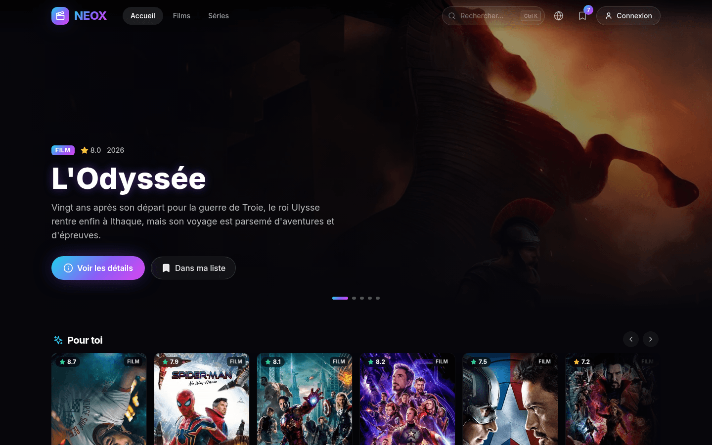
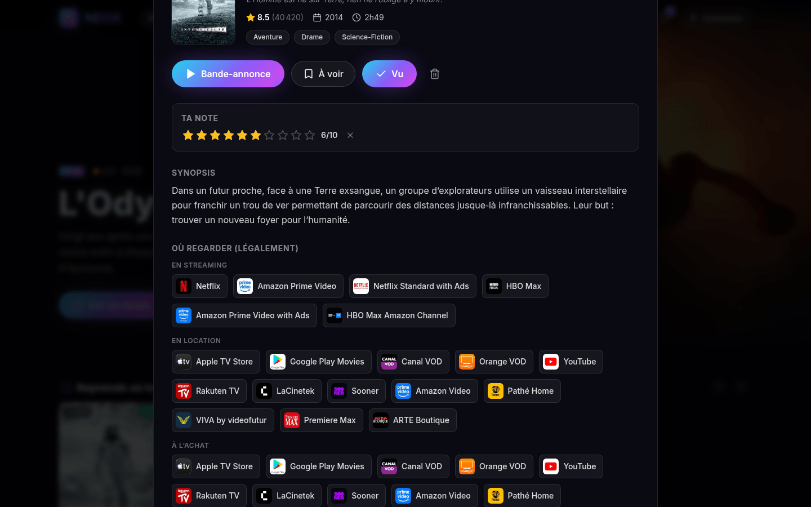
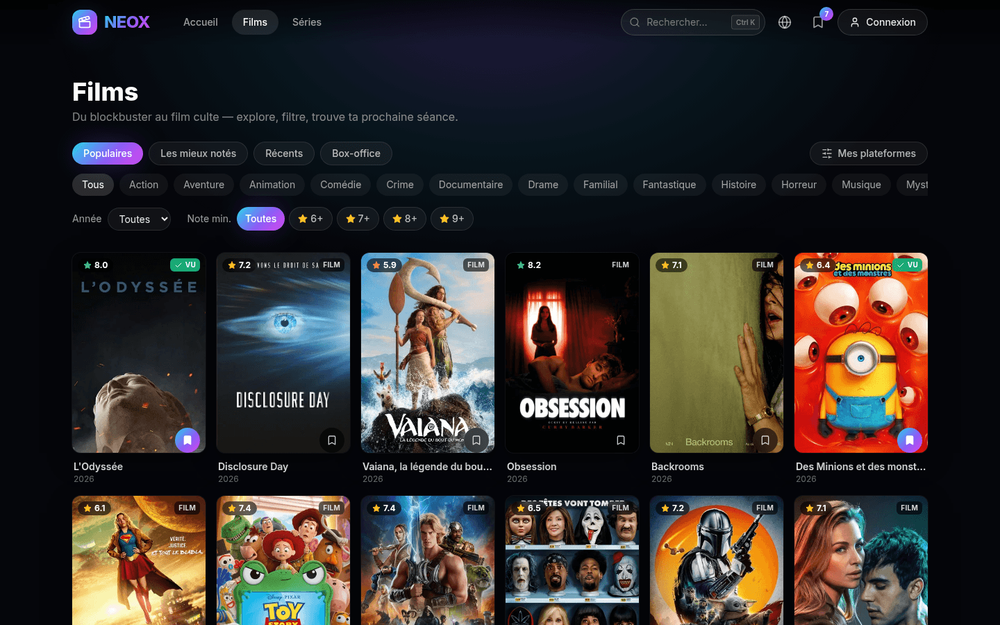
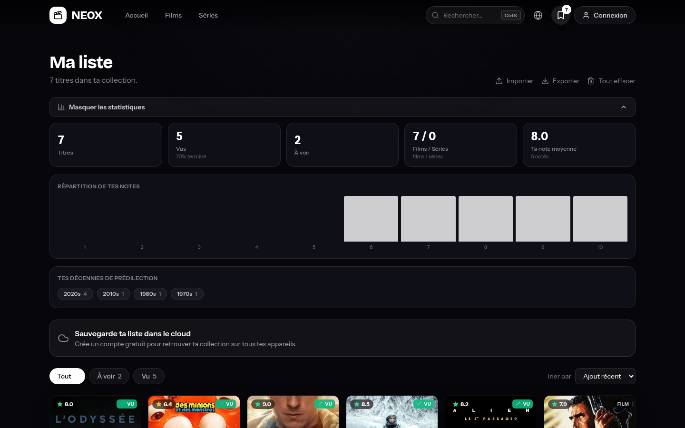
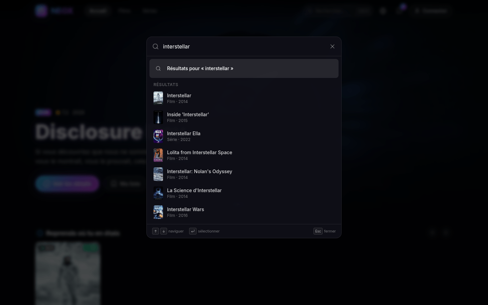

<div align="center">

# NEOX

### Ton radar cinéma & séries.

Découvre les tendances, lance la bande-annonce, et sache tout de suite où regarder, légalement.

React + TypeScript + Vite · Node + Express · TMDB API

[](https://github.com/nohe-sohbi/neox/actions/workflows/ci.yml)
[](LICENSE)

**[Démo live → neox.sohbi.dev](https://neox.sohbi.dev)**

</div>

<div align="center">

|  |  |
|---|---|
|  |  |
| **Accueil** : hero + rails éditorialisés | **Fiche** : où regarder, en streaming, location ou achat |
|  |  |
| **Explorer** : filtres et scroll infini | **Ma liste** : notes et statistiques |
|  | |
| **Ctrl K** : recherche instantanée et navigation | |

</div>

---

## C'est quoi NEOX ?

Tu cherches une pépite à regarder ce soir. NEOX te montre les tendances du moment, te lance la
bande-annonce, et te dit sur quelles plateformes légales le titre est disponible dans ta région,
en streaming, en location ou à l'achat. Un clic sur le marque-page et c'est dans ta liste.

Aucun contenu n'est hébergé ni diffusé : NEOX agrège des métadonnées publiques (TMDB) et la
disponibilité légale (JustWatch via TMDB).

## Ce que ça fait

- **Découvrir** : accueil éditorialisé (hero rotatif, rails « À l'affiche », « Tendances séries »,
  « Acclamés par la critique »), recherche instantanée sur les films, les séries et les personnes
  (acteurs, réalisateurs), chargée page après page en scroll infini.
- **Savoir où regarder** : la section « Où regarder (légalement) » de chaque fiche liste le
  streaming, la location et l'achat pour ta région, avec un filtre « Mes plateformes » qui ne garde
  que tes services.
- **Explorer finement** : genre, année de sortie, note minimale (6+/7+/8+/9+), tri par popularité,
  note, date ou box-office, en scroll infini avec compteur de résultats. Les filtres vivent dans
  l'URL : une vue filtrée se partage, se met en favori et se retrouve au retour.
- **Naviguer au clavier** : palette `Ctrl K` globale pour chercher un titre, sauter vers une page ou
  reprendre une recherche récente, sans quitter le clavier.
- **Suivre ses séries** : navigateur par saison dans la fiche, liste des épisodes avec vignette,
  code `SxEx`, date, durée et note, chargée à la demande.
- **Tenir sa liste** : statut À voir / En cours / Vu, note personnelle de 1 à 10, tri, filtres par
  statut et par type, recherche texte insensible aux accents, et un panneau de statistiques calculé
  localement (progression, répartition films/séries, note moyenne, histogramme des notes, décennies
  de prédilection).
- **Partager une fiche** : chaque fiche titre ou personne porte un bouton Partager — feuille de
  partage système quand elle existe, copie du lien canonique sinon.
- **Retrouver sa liste partout** : compte optionnel (inscription, connexion, changement de mot de
  passe, suppression du compte) qui synchronise la bibliothèque entre appareils. Sans compte, tout
  reste en local, avec export et import JSON.
- **Installer l'app** : PWA avec shell hors-ligne et images en cache, interface traduite en
  français, anglais, espagnol, allemand et italien — la langue suit celle du navigateur au premier
  lancement.

## Sous le capot

Ce qui n'est pas visible à l'écran mais tient l'app debout :

- **La clé TMDB ne quitte jamais le serveur.** Le frontend ne parle qu'à l'API NEOX, qui met en
  cache et normalise chaque réponse.
- **Trois couches contre les pannes amont.** Un cache LRU + TTL en `stale-while-revalidate` sert la
  donnée légèrement périmée plutôt qu'une erreur ; le coalescing (single-flight) réduit N
  cache-miss concurrents à un seul appel amont ; un disjoncteur ouvre le circuit après une série
  d'échecs et se referme via une requête sonde. Métriques et état exposés sur `/api/health`.
- **Redémarrage à chaud.** Sur `SIGTERM`, le serveur snapshote le cache TMDB sur disque et le
  réhydrate au boot : un redéploiement ne repart plus cache vide.
- **Cache HTTP.** Les endpoints de lecture envoient `Cache-Control` et des ETags forts, les routes
  privées sont en `no-store`.
- **Auth self-contained.** bcrypt + JWT + store JSON atomique, aucun SaaS tiers. L'API refuse de
  démarrer en production sans `JWT_SECRET`. Changer son mot de passe révoque chaque jeton déjà
  émis (le jeton porte l'horodatage du dernier changement), et le jeton d'un compte supprimé meurt
  immédiatement au lieu de survivre trente jours.
- **Entrées bornées et typées.** Le tri d'Explorer passe par une allowlist, la pagination est
  plafonnée au maximum TMDB, les identifiants de plateformes doivent être numériques et une
  région ou langue malformée est ignorée : aucune chaîne arbitraire ne mine de clé de cache ni
  n'atteint l'amont. Une exception inattendue répond un message générique, le détail restant dans
  le log serveur.
- **Accessibilité.** Les quatre overlays partagent un hook `useModal` (piège de focus, restauration,
  `Escape`, verrou de scroll, `role="dialog"`), les actions passent par une région `aria-live`, il y
  a un skip-link. Contrastes mesurés, pas estimés : tout le texte passe le 4.5:1 de WCAG AA sur le
  fond `ink-950`. `prefers-reduced-motion` réduit les transitions à 80 ms et coupe les transformées
  au lieu de tout annuler : un bouton qui ne réagit plus du tout se lit comme cassé, pas comme calme.
- **Typographie auto-hébergée.** Bricolage Grotesque pour les titres, Instrument Sans pour
  l'interface, en variable woff2 servi par le bundle. Aucune requête vers un CDN de polices, ce qui
  serait incohérent pour une app qui ne charge même pas de script d'analytics par défaut. Les deux
  sous-ensembles latins sont préchargés depuis le shell : leurs noms étant hashés par le build,
  c'est lui qui pose les balises.
- **Perf client.** Cache mémoire SWR avec dédup des requêtes en vol, `srcset` dérivé côté client des
  URLs TMDB, `ErrorBoundary` global au lieu d'un écran blanc.
- **L'interface n'a pas de couleur d'accent.** Elle emprunte celle du titre affiché : la teinte
  dominante de l'affiche est extraite dans le navigateur, pondérée par la saturation puis rendue
  comme de la lumière, et c'est elle qui colore le hero, la carte survolée et la fiche ouverte. Là où
  aucun titre n'est en contexte, comme la barre de navigation, l'état actif reste un blanc neutre.
  Coût : zéro travail serveur, `image.tmdb.org` répondant `access-control-allow-origin: *`, et un
  échantillon `w92` de quelques kilo-octets mis en cache un an.
- **SEO : un shell prérendu par route.** Un SPA n'émet qu'un `index.html`, donc toutes les URLs
  reçoivent le `<head>` de l'accueil — même titre, même canonique. Ici le build en génère un par
  route depuis un manifeste unique (`src/lib/routes.ts`), qui pilote aussi le `sitemap.xml` et
  ce que les vues réappliquent après hydratation : le document vivant ne contredit jamais le shell
  qui l'a servi. Chaque page arrive donc avec son `title`, sa `description`, sa canonique, ses
  balises Open Graph / Twitter et, sur l'accueil, un `@graph` `WebSite` + `Organization`. Le corps
  porte un bloc `noscript` avec le titre, la description et les liens de section : ce que lit un
  moteur qui n'exécute pas JS. Une fois l'app démarrée, le `<head>` suit la route et la fiche
  ouverte, avec `Movie` / `TVSeries` sur une fiche et `Person` sur un profil — `aggregateRating`
  n'étant émis que si un vrai nombre de votes le porte, parce que Google rejette une note sans
  compteur. Les surfaces sans valeur de recherche (`/search`, `/library`) sont servies en `noindex`
  plutôt que bloquées dans `robots.txt` : une URL interdite au crawl ne fait jamais lire son
  `noindex`. Même raison pour `/api`, qui répond `X-Robots-Tag: noindex` : Googlebot appelle ces
  endpoints pendant le rendu, les bloquer lui ferait rendre une application vide.
- **Une URL par page.** `/movies/` est redirigée en 301 vers `/movies`, et une adresse inconnue
  répond un vrai 404 portant la vue « page introuvable » — pas une redirection silencieuse vers
  l'accueil, qui ferait de chaque lien mort un doublon de la page d'accueil. Les fiches sont
  atteignables : les cartes sont de vraies ancres vers `/?watch=type-id`, la forme que la fiche
  déclare canonique.
- **Analytics optionnelle et sans cookie.** Aucun script n'est chargé tant que
  `VITE_UMAMI_WEBSITE_ID` n'est pas défini. Quand elle est active, une instance
  [Umami](https://umami.is) auto-hébergée compte les pages et onze actions produit (`Open Detail`,
  `Trailer Play`, `Providers Click`, `Palette Open`, `Rating Set`, `Library Add`, `Library Import`,
  `Library Export`, `Share`, `Signup`, `Login`). Aucune propriété d'événement ne porte de donnée personnelle :
  pas d'e-mail, pas de terme de recherche, seulement des compteurs et des types de média.
  `VITE_UMAMI_DOMAINS` limite le tracker au domaine de production, donc une session locale ne
  pollue pas les statistiques.

## Architecture

```
neox/
├── backend/            API Node/Express : proxy TMDB + comptes + sync
│   ├── server.js       routes, validation, gestion d'erreurs centralisée
│   ├── tmdb.js         client TMDB (retry/backoff, normalisation)
│   ├── cache.js        cache LRU + TTL + stale-while-revalidate + snapshot/hydrate
│   ├── single-flight.js coalescing des requêtes amont concurrentes
│   ├── circuit-breaker.js disjoncteur sur la santé de TMDB
│   ├── http-cache.js   middlewares Cache-Control, ETag/304, no-store
│   ├── auth.js         bcrypt + JWT, middleware requireAuth
│   ├── store.js        store JSON persistant, atomique, zéro dépendance
│   └── library.js      validation et merge des bibliothèques
└── project/            Frontend React + TypeScript + Vite + Tailwind
    └── src/
        ├── lib/        client API typé, query (SWR + dédup), i18n, library-io, routes (manifeste SEO), seo, structured-data, film-color, img
        ├── context/    AuthContext, LibraryContext
        ├── hooks/      useQuery, useDebounce, useMyPlatforms, useModal, useDocumentMeta, useFilmColor
        ├── components/ layout, media, home, auth, ui, command
        └── views/      Home, Discover, Search, Library, NotFound
```

La bibliothèque est localStorage-first, puis fusionnée au compte à la connexion.

## Démarrage

### Prérequis
- Docker + Docker Compose, ou Node 20+
- Une clé API TMDB, gratuite : https://www.themoviedb.org/settings/api

### 1. Configurer
```bash
cp .env.example .env
# Renseigne TMDB_API_KEY, puis génère un secret de signature :
openssl rand -hex 32   # à coller dans JWT_SECRET
```

`docker compose` refuse de démarrer si `TMDB_API_KEY` ou `JWT_SECRET` manquent : un secret JWT par
défaut partagé permettrait à n'importe qui de forger un jeton pour n'importe quel compte.

### 2a. Lancer avec Docker (recommandé)
```bash
docker compose up --build
```
App sur http://localhost:8080, `WEB_PORT` pour changer de port.

Le stack est façonné pour la production : le frontend est buildé puis servi en statique par nginx
(assets hashés en cache long, shell et service worker en `no-cache`), et l'API est proxyfiée sous le
même domaine en `/api`. Le navigateur ne fait aucun appel cross-origin, le backend n'expose aucun
port publiquement, et il ne reste qu'un port à placer derrière ton terminateur TLS.

Pour un déploiement sur ton domaine, renseigne aussi `VITE_SITE_URL` : elle pilote les URLs
canoniques et Open Graph, et réécrit `robots.txt`, `sitemap.xml` et les shells prérendus au build.

> Vite inline ses variables au build, pas au démarrage du conteneur. Après avoir changé un `VITE_*`,
> reconstruis l'image (`docker compose up --build`).

### 2b. Lancer en local, sans Docker
Le mode à utiliser pour développer, avec hot-reload des deux côtés :
```bash
# Terminal 1, API
cd backend && npm install && npm run dev

# Terminal 2, frontend
cd project && npm install && npm run dev
```
Frontend sur http://localhost:5173, API sur http://localhost:3001.

Sans `VITE_API_URL`, le frontend vise `http://localhost:3001`. Le mettre à la chaîne vide bascule en
même-origine (`/api`), ce que fait l'image Docker.

## API

| Méthode | Route | Description |
|---|---|---|
| GET | `/api/health` | État du service, config TMDB, métriques cache et disjoncteur |
| GET | `/api/home` | Payload accueil (hero + rails) |
| GET | `/api/search?q=&page=` | Recherche multi (films + séries, personnes dans `people`) |
| GET | `/api/trending/:type?window=week\|day` | Tendances (`all`/`movie`/`tv`) |
| GET | `/api/discover/:type?genre=&sort=&year=&minRating=&providers=&page=` | Exploration filtrée |
| GET | `/api/genres/:type` | Genres (`movie`/`tv`) |
| GET | `/api/providers/:type?region=` | Plateformes de streaming d'une région |
| GET | `/api/person/:id` | Profil et filmographie d'une personne |
| POST | `/api/recommendations` | « Pour toi » à partir de `{ seeds: [...] }` |
| GET | `/api/:type/:id` | Fiche complète, providers, casting, reco, saisons pour `tv` |
| GET | `/api/tv/:id/season/:season` | Épisodes d'une saison |
| POST | `/api/auth/register` | Création de compte, renvoie `{ token, user }` |
| POST | `/api/auth/login` | Connexion, renvoie `{ token, user }` |
| GET | `/api/auth/me` 🔒 | Profil du token courant |
| POST | `/api/auth/change-password` 🔒 | Change le mot de passe, révoque les anciens jetons |
| DELETE | `/api/auth/account` 🔒 | Supprime le compte et sa bibliothèque (confirmation par mot de passe) |
| GET | `/api/library` 🔒 | Bibliothèque du compte |
| PUT | `/api/library` 🔒 | Remplace la bibliothèque |
| POST | `/api/library/merge` 🔒 | Fusionne local et serveur |

🔒 requiert l'en-tête `Authorization: Bearer <token>`.
Les endpoints TMDB acceptent `?region=` et `?lang=` pour localiser résultats et disponibilités.

## Qualité

- **243 tests** : 95 côté `backend/` (auth, gestion de compte et sync via supertest, garde du
  secret JWT, révocation de jetons, durcissement des entrées, cache HTTP, cache LRU et
  snapshot/hydrate, single-flight, params discover, saisons, directives crawler, et le chemin
  réseau du client TMDB — retry, 429, snapshot sans secret — contre un serveur fixture injecté via
  `TMDB_BASE_URL`) et 148 côté `project/` (bibliothèque, export/import, recherche de titres,
  partage, détection de langue, i18n avec test de parité des cinq dictionnaires, manifeste de
  routes et shells prérendus, SEO, données structurées, extraction de teinte, cache SWR, vu
  récemment, srcset).
- **Vérifs** : `npm run lint`, `npm run typecheck`, `npm run build`.
- **CI** : GitHub Actions lance lint, typecheck, tests et build sur chaque PR
  (`.github/workflows/ci.yml`).

## Sécurité

- La clé TMDB ne quitte jamais le serveur.
- Aucun secret versionné : `.env` est ignoré, seul `.env.example` est suivi.
- L'API refuse de démarrer en `NODE_ENV=production` sans `JWT_SECRET` : un secret de repli connu de
  tous vaut une absence d'authentification.
- Mots de passe hachés bcrypt, jetons JWT signés, `helmet`, rate-limit global et limiteur strict sur
  `/api/auth`, corps de requête bornés et typés (un e-mail non-string répond 400, jamais 500).
- La clé TMDB n'entre jamais dans les clés de cache : le snapshot disque n'en contient aucune
  trace, et une rotation de clé ne vide pas le cache.
- Les routes privées (`/api/library`, `/api/auth/me`) sont en `no-store`, jamais mises en cache par
  un navigateur ou un CDN.

## Stack

**Frontend** : React 18 · TypeScript · Vite · Tailwind CSS · lucide-react · Bricolage Grotesque + Instrument Sans
**Backend** : Node 20 · Express · node-fetch · cache en mémoire
**Déploiement** : Docker multi-stage · nginx (statique + proxy `/api`)
**Données** : [TMDB](https://www.themoviedb.org/) · disponibilité via JustWatch

## Licence et mentions

Publié sous licence **[MIT](LICENSE)**.

Ce produit utilise l'API TMDB mais n'est ni approuvé ni certifié par TMDB.
NEOX n'héberge, ne stocke et ne diffuse aucun contenu vidéo.
